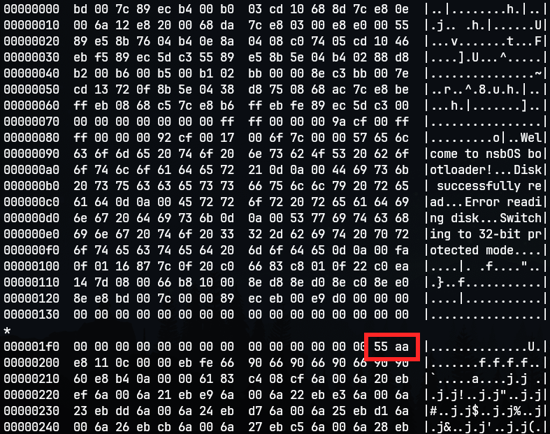
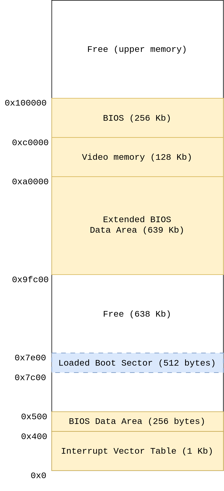

# Bootloader

\
When the computer turns on, it loads and starts executing the BIOS code. The BIOS then searches for bootable devices. In this case, it looks for a floppy disk that contains a boot sector. The boot sector is the first memory block, which is 512 bytes in size and contains a special value known as the _magic number_.

_The magic number_ serves as a flag for the BIOS, indicating that the sector contains executable bootloader code. It conventionally resides at the end of the sector (last 2 bytes) and is represented by the value `0x55aa`. So byte `0x55aa` should be located at address `0x1fe`.

When BIOS finds boot sector it loads it at address `0x7c00` in memory and passes the execution to the bootloader. Bootloader is compiled so all labeles inside of assembly code are calculated relatively to this address. After that, bootloader needs to read other sector from the disk. These sectors effectively contain the entire operating system and other user programs.

Luckly our good old friend BIOS has some built in routines that can read floppy disk contents. Bootloader reads from floppy disk by putting arguments in registers and executing BIOS system call. This call is invoked with `int 0x13` instruction. Bootloader of `nsbOS` copies contents of floppy disk starting from address `0x7e00` - right behind where the bootloader is placed in memory. See _Figure 2_ for better understanding.

**NOTE:** most of the things mentioned here are legacy things that BIOS does. Today, most operating systems don't use _legacy-BIOS_ method in order to boot, instead they rely on UEFI which is newer standard for booting.

\pagebreak

