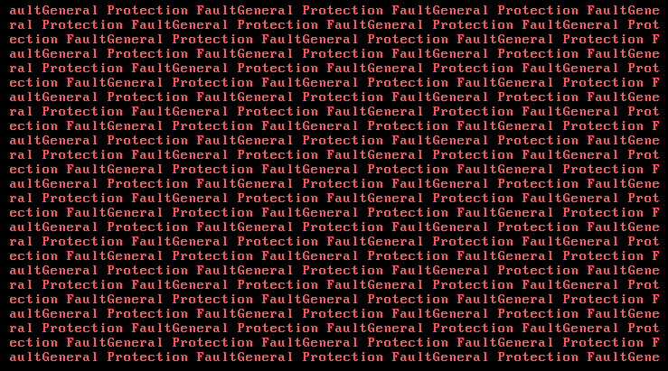

# Kernel

\
Once the boot phase is complete, the kernel requires a mechanism to handle interrupts. Interrupts are special signals that indicate to the CPU that an urgent task needs to be processed, such as hardware events, exceptions, or other software-related events. These interrupts are managed by specific functions known as _interrupt routines_.

When an interrupt occurs, the CPU temporarily suspends its current execution and shifts to executing the interrupt routine assigned to that specific interrupt. The interrupt routine is responsible for handling the specific task associated with the interrupt.

Following things in order are done by the kernel:

- Initialization of the Interrupt Descriptor Table (IDT): The kernel sets up the IDT, which is a data structure that maps specific interrupt numbers to their corresponding Interrupt Service Routines (ISRs).

- Setting up the first 32 ISR entries: The kernel initializes the IDT with the necessary code addresses to handle the first 32 interrupt events, which include critical system exceptions and processor-defined interrupts.

- Remapping the primary and secondary Programmable Interrupt Controller (PIC) chips: The kernel configures the PIC chips to properly manage and prioritize hardware interrupt. PIC chisp are resposnible for passing hardware requests to the CPU directly, so the CPU doesn't need to ask every hardware device if it needs servicing.

- Setting up 15 IRQ entries: The kernel populates the IDT with the required ISRs to handle the remaining 15 interrupt requests (IRQs) generated by various hardware devices.

- Setting up software interrupt routines: The kernel includes additional entries in the IDT to accommodate software-generated interrupts, allowing software components to trigger specific system functions or services.

- Passing the IDT descriptor to the CPU: Once the IDT is fully configured, the kernel passes the descriptor, containing the IDT's memory address, to the CPU. This enables the CPU to efficiently access and execute the appropriate ISR when an interrupt occurs.

By performing these tasks, the kernel establishes the necessary infrastructure for interrupt handling.

### Interrupt handling steps

\
Let's say software interrupt happened which was called using `int 0x80` assembly instruction. This instruction interrupts the CPU and the following steps describe what happens in order for this interrupt to get handeled:

- The CPU uses the interrupt number (in this case, `0x80`) to locate the corresponding entry in the Interrupt Descriptor Table (IDT), which contains the address of the interrupt handler.

- The interrupt routine associated with the interrupt number is a small piece of assembly code that performs specific actions. Depending on the type of interrupt, it may push the interrupt number and error code (if applicable) onto the stack.

- Before executing the interrupt routine, the CPU saves the state of the general-purpose registers and segment registers onto the stack. This creates an interrupt frame, which allows the interrupt routine to access any data passed through registers.

- Once the interrupt frame is established, the CPU transfers control to the interrupt routine. The routine executes the necessary tasks to handle the specific interrupt.

- Upon completion of the interrupt routine's execution, the interrupt frame is restored, freeing up the stack space that was allocated.

- The CPU returns from the interrupt and resumes the execution of the interrupted task.

### Example of inner exception

\
Here is one interesting example that happend during development phase. Debugging showed that descriptors inside of GDT were wrongly configured, which caused `General Protection Fault` exception to happen. This was displayed on the screen when the OS booted:

\pagebreak
