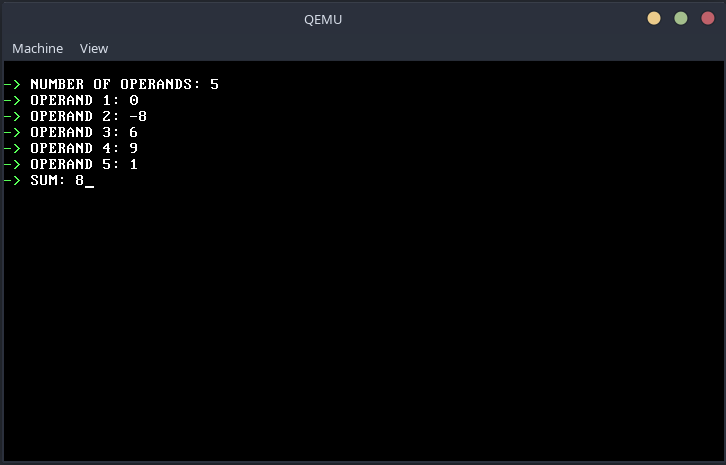

# User program

\
User program is pretty simple at the moment it can only calculate sum of operands. User passes number of operand, then passes all operands and the total sum is displayed. In the background user program calls `printf` and `scanf` functions which parse string to integer (and vice versa) and execute system calls for writing to the screen and reading user input from keyboard. Kernel is the one who handles these system calls.

\

\
This component still needs some testing and developing...

\pagebreak

